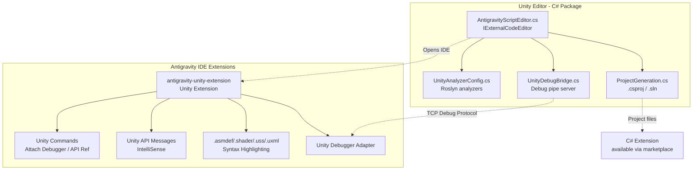

# Antigravity IDE — Unity Integration Upgrade Plan

## Background & Research Summary

### VS Code Unity Integration Stack (Reference)
VS Code's Unity support is a **3-layer architecture**:

| Layer | Extension | Source |
|---|---|---|
| **C# Language** | `ms-dotnettools.csharp` (vscode-csharp) | OmniSharp + Roslyn language server, IntelliSense, code navigation |
| **C# Dev Kit** | `ms-dotnettools.csdevkit` (vscode-dotnettools) | Solution explorer, test runner, project management — **closed-source**, repo is issue tracker only |
| **Unity** | `VisualStudioToolsForUnity.vstuc` | Unity debugger, Unity-specific C# analyzers, `.asmdef/.shader/.uss/.uxml` coloration, Unity API IntelliSense |

### Submodule Analysis
- `vscode-csharp` — **Full source code** (TypeScript, 800+ files). Contains C# language features, debugger, OmniSharp integration.
- `vscode-dotnettools` — **Issue tracker only**, no source code. Limited reference value.

---

## Architecture

Since Antigravity IDE is built on **Electron/VS Code core** (like Cursor, Windsurf), it can natively install VS Code extensions. The strategy is **dual-pronged**: enhance the Unity Editor package AND create Antigravity-specific IDE extensions.



---

## Phase 1: Enhanced Unity Editor Package ✅ (Completed)

- `ProjectGeneration.cs` — LangVersion, DefineConstants, Roslyn analyzers, .vscode configs, Directory.Build.props
- `AntigravityScriptEditor.cs` — Preferences GUI, --reuse-window, --goto, workspace-first args
- `UnityDebugBridge.cs` — TCP debug bridge with menu items
- `UnityAnalyzerConfig.cs` — .editorconfig + GlobalSuppressions generation
- `package.json` — v2.0.0, Unity ≥2021.3

---

## Phase 2: Antigravity Unity Extension (subdirectory)

A TypeScript-based IDE extension (VSCode extension format) providing:

### Syntax Highlighting
- `.asmdef` / `.asmref` — JSON with Unity schema validation
- `.shader` / `.cginc` / `.hlsl` — ShaderLab + HLSL/CG grammar
- `.uss` — Unity Style Sheets (CSS-like)
- `.uxml` — Unity XML (XML with Unity schema)

### Unity Debugger
- Debug Adapter Protocol (DAP) implementation for Unity
- "Attach Unity Debugger" command — discover Unity instances on network
- Support for Editor, Standalone, Android, iOS, Console players
- `launch.json` configuration type `antigravity-unity`

### Unity IntelliSense Enhancement
- Code completion for Unity API Messages (Start, Update, OnCollisionEnter, etc.)
- Quick documentation for Unity API via hover provider
- "Open Unity API Reference" command

### Commands
- `Antigravity: Attach Unity Debugger` — discover and attach to Unity instances
- `Antigravity: Unity API Reference` — open docs for selected symbol
- `Antigravity: Regenerate Project Files` — trigger .csproj regeneration

### Extension Structure
```
antigravity-unity-extension/
├── package.json          # Extension manifest
├── tsconfig.json         # TypeScript config
├── src/
│   ├── extension.ts      # Entry point
│   ├── debugger/         # DAP implementation
│   ├── completion/       # Unity API completions
│   └── commands/         # Command implementations
├── syntaxes/             # TextMate grammars
│   ├── shaderlab.tmLanguage.json
│   ├── uss.tmLanguage.json
│   ├── uxml.tmLanguage.json
│   └── asmdef.tmLanguage.json
└── snippets/
    └── unity-csharp.json # Unity C# snippets
```

---

## Verification Plan

### Phase 1
- Import package into Unity 2021+ project via Package Manager
- Verify .csproj generation, debug bridge, analyzer configs

### Phase 2
- Install extension in Antigravity IDE
- Verify syntax highlighting for .shader, .asmdef, .uss, .uxml
- Verify Unity debugger attachment
- Verify Unity API IntelliSense completions
